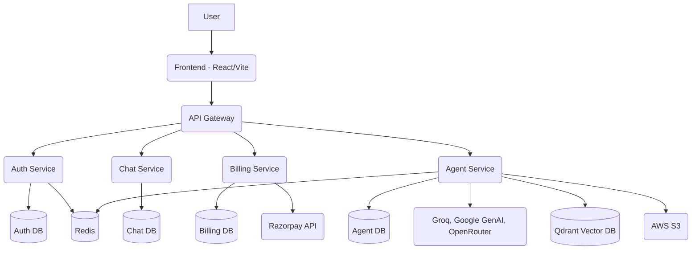

# CortexAI — Multi-Agent AI Platform

CortexAI is a comprehensive, multi-agent AI platform enabling intelligent conversations, document processing (RAG), and specialized AI tasks through an orchestrated microservices architecture.

## Features
- **Multi-agent AI architecture**: Intelligent orchestration of multiple AI agents (Chat, Coding, Vision, PDF, PPT, Search).
- **RAG & Document Processing**: Upload, parse, and chat with PDFs/PPTs.
- **Authentication**: Secure Firebase integration for user management.
- **Microservices Architecture**: Independently scalable services for auth, billing, chat, and agents.
- **Vector Database Integration**: Uses Qdrant for semantic search and embeddings.
- **Integrated Billing**: Razorpay integration.

## Architecture

CortexAI utilizes a modern microservices architecture with a dedicated gateway routing requests to specialized services.



## System Connections

### Frontend → Backend
- **Base URL**: `http://localhost:8000`
- **Communication**: REST API via Axios.

### Gateway → Microservices
- The Gateway (Express + HTTP Proxy) routes requests to specific microservices on ports `8001` to `8004`.

### Backend → Databases
- **MongoDB**: Used across all services (Auth, Chat, Billing, Agent) using Mongoose.
- **Redis**: Used for caching and pub/sub by Auth and Agent services.
- **Qdrant**: Used by the Agent service for vector storage.

### Backend → AI Providers
- **Providers**: Groq, Google Gemini, OpenRouter, Tavily.
- **Flow**: User -> Gateway -> Agent Service -> Langchain Graph -> LLM API -> Final Response.

## Technology Stack

### Frontend
- React
- Vite
- Tailwind CSS
- Redux Toolkit
- Firebase (Auth)

### Backend
- Node.js & Express.js
- Mongoose (MongoDB)
- Redis (ioredis)
- LangChain

### AI & Integrations
- Groq, Google GenAI, OpenRouter
- Qdrant
- AWS S3
- Razorpay

## Project Folder Structure

```text
CortexAI/
│
├── frontend/             # React + Vite application
│   ├── src/
│   ├── public/
│   └── package.json
│
├── backend/              # Microservices Backend
│   ├── gateway/          # API Gateway
│   ├── services/
│   │   ├── agent/        # LangChain & Multi-agent orchestration
│   │   ├── auth/         # Firebase & JWT authentication
│   │   ├── billing/      # Razorpay integration
│   │   └── chat/         # Chat history management
│   ├── shared/           # Shared utilities and configurations
│   └── docker-compose.yml
│
├── .env.example
├── .gitignore
└── README.md
```

## Local Setup Guide

### Prerequisites
- Node.js (v18+)
- npm or yarn
- Docker (for Redis)
- MongoDB Atlas (or local MongoDB)

### Environment Setup

1. Copy the example environment file in the root directory:
```bash
cp .env.example .env
```
*(Note: CortexAI uses separate `.env` files for each microservice and the frontend. Ensure you configure each service appropriately based on `.env.example`)*

### Installation

1. Install Frontend dependencies:
```bash
cd frontend
npm install
```

2. Install Backend Gateway dependencies:
```bash
cd backend/gateway
npm install
```

3. Install Microservice dependencies:
```bash
cd ../services/agent && npm install
cd ../auth && npm install
cd ../billing && npm install
cd ../chat && npm install
```

### Database & Redis Setup

Start Redis using Docker Compose:
```bash
cd backend
docker compose up -d redis
```

### Running CortexAI

You will need multiple terminal windows to run all services locally.

**Terminal 1 — Redis**
```bash
cd backend
docker compose up redis
```

**Terminal 2 — Gateway**
```bash
cd backend/gateway
npm run dev
```

**Terminal 3 — Auth Service**
```bash
cd backend/services/auth
npm run dev
```

**Terminal 4 — Chat Service**
```bash
cd backend/services/chat
npm run dev
```

**Terminal 5 — Agent Service**
```bash
cd backend/services/agent
npm run dev
```

**Terminal 6 — Billing Service**
```bash
cd backend/services/billing
npm run dev
```

**Terminal 7 — Frontend**
```bash
cd frontend
npm run dev
```

## API Documentation

*(Core API Routes)*

| Method | Endpoint | Description | Service |
| ------ | -------- | ----------- | ------- |
| POST | `/api/auth/*` | User authentication | Auth |
| GET | `/api/chat/*` | Fetch user chats | Chat |
| POST | `/api/agent/*` | Trigger specific AI agents | Agent |
| POST | `/api/billing/*` | Payment processing | Billing |

## Troubleshooting

- **Redis connection failed**: Ensure Docker is running and you executed `docker compose up redis`.
- **CORS Error**: Verify the `FRONTEND_URL` matches your local Vite port (usually `5173`).
- **MongoDB connection failed**: Check your network connection to MongoDB Atlas, ensure your IP is whitelisted, and verify the URI in `.env`.

## Security & Secrets
**WARNING**: Several `.env` files containing live secrets (MongoDB URIs, AWS Keys, LLM API Keys, Firebase) were discovered. They have been correctly added to `.gitignore`, but if they were previously tracked, the keys **must be rotated immediately**.

## License
ISC
